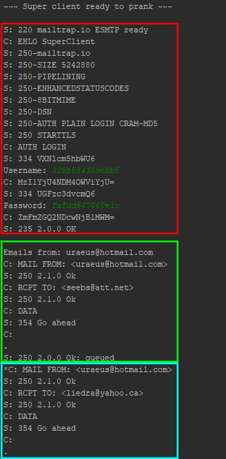

<div style="text-align: right;">Julien Quartier & Nathan Séville</div>

# Teaching-HEIGVD-RES-2019-Labo-SMTP

## Description
Simple SMTP client implemented in JAVA.

The email of each group is chosed randomly from the user defined list as the sender and the victims.

Each of the groups have a uniq sender, message and recipients addresses.


## Setup instructions

### Mockmock on Docker

> MockMock is a cross-platform SMTP server built on Java.
>
> MockMock GitHub: <https://github.com/tweakers/MockMock>

> If you don't have docker installed, install it before following following instructions.

In project's root directory build docker image with:

- `docker build -t mockmock .`

Create docker mockmock container:

- `docker run -d -p 2525:2525 -p 8282:8282 --name mockmock mockmock`

You can now access mockmock web interface at docker's container ip address on port `8282`.

You can stop container at any time with:

- `docker stop mockmock`

Start it again with:

- `docker start mockmock`

Delete container with:

- `docker rm mockmock`

### Prank campaign configuration
The app is configured with three files.
#### config.properties
This file is used for basic app configuration. 
* `serverhost` define the mail server ip address or hostname
* `serverport` define the mail server port
* `groupcount` the number of spamming groups to create randomly
```
serverhost=smtp.mailtrap.io
serverport=2525

groupcount=60
```

#### messages.json
In this file you can define each spam email. You can define a `subject` and a `body` value. You can add as much email as you want.
One email is selected randomly for each group. 
```json
[
  {
    "subject": "Morbi vulputate ultricies",
    "body": "Lorem ipsum dolor sit amet, consectetur adipiscing elit. Fusce pharetra malesuada luctus. Morbi vulputate ultricies euismod. Ut consequat hendrerit viverra. Etiam faucibus posuere sapien ac feugiat. Morbi faucibus elit ac nibh blandit, a venenatis dolor porta. Phasellus scelerisque scelerisque elit, ac facilisis erat gravida sit amet. \r\nClass aptent taciti sociosqu ad litora torquent per conubia nostra, per inceptos himenaeos. Mauris elementum scelerisque arcu, nec posuere risus efficitur sit amet. Fusce pharetra tempor ex, ac maximus massa facilisis eu. Vivamus et sem dui. Vestibulum sapien ligula, venenatis ut dictum sit amet, aliquam nec risus. Nam eget aliquam tellus, rhoncus lacinia sem. \r\nVestibulum congue elit orci, eu sodales velit egestas et."
  },
  {
    "subject": "Nunc maximus",
    "body": "Aliquam erat volutpat.\r\n\r\nPraesent dignissim nulla eu neque feugiat rhoncus. Nunc maximus mattis est quis ornare. Vivamus sit amet felis egestas, scelerisque massa eget, ultrices mauris. Proin tristique leo eu enim rhoncus, eu ornare arcu tempus. Curabitur sit amet euismod est. Integer lectus nisl, finibus ac gravida eget, posuere at ex. \r\nNunc ut euismod tellus. Integer nec elit auctor, egestas ante et, tincidunt risus. Mauris ut ex eget velit consequat posuere at nec leo. Donec eu sapien at erat iaculis dapibus."
  }
]
```

#### victims.list
This file contains a list of all target email. Each address is separated with a new line.
Example with random emails:
```
teverett@att.net
dkeeler@mac.com
techie@gmail.com
jdhedden@outlook.com
ullman@yahoo.com
oechslin@verizon.net
rupak@live.com
```


## Implementation description


### Configuration loaders (*Config namespace*)
The app has three configurations loaders. Their role is to parse the parse and validate data.
* `ConfigManager` Load app properties.
* `MessagesLoader` Parse JSON containing messages.
* `VictimsLoader` Parse email list

### SMTP namespace
Classes used only for the implementation of smtp.
* `Smtp\Email` The email class contains all data defining an email (Subject, from, to and body). On construct create Header objects (FROM, TO, DATE and SUBJECT).
* `Smtp\Sender` Handle all communication between the client and the server. If the server implements PLAIN auth, asks the user to input his credentials. Runs the sequence of the protocol (HELO, AUTH?, DATA+, QUIT), checks at each step if the server reponse is the expected one.
* `Smtp\Client` Establishes the low-level socket with the smtp server. Provides two streams, a reader and a writer.

### Model namespace
Simple objects defining program datas. 

###Exchange between client and server



> you can show full client / server communication by setting `Sender.debug` to `true`

* **RED** the hello squence and authentication between the server and client. The server response contains supported mods (code `250`). The app user is asked for credentials. As the used auth method is *PLAIN* the client sends username and password in base64. If the server repond with `235` we can begin to send emails.
* **GREEN** Sends the first email. Starts with server *Header* once done sends *DATA* command that says we are beginning to sends actual email content.
* **BLUE** An another email. Same as before.
* **NOT SHOWN** After the last email, the command *QUIT* is sent to the server to close the connection.


