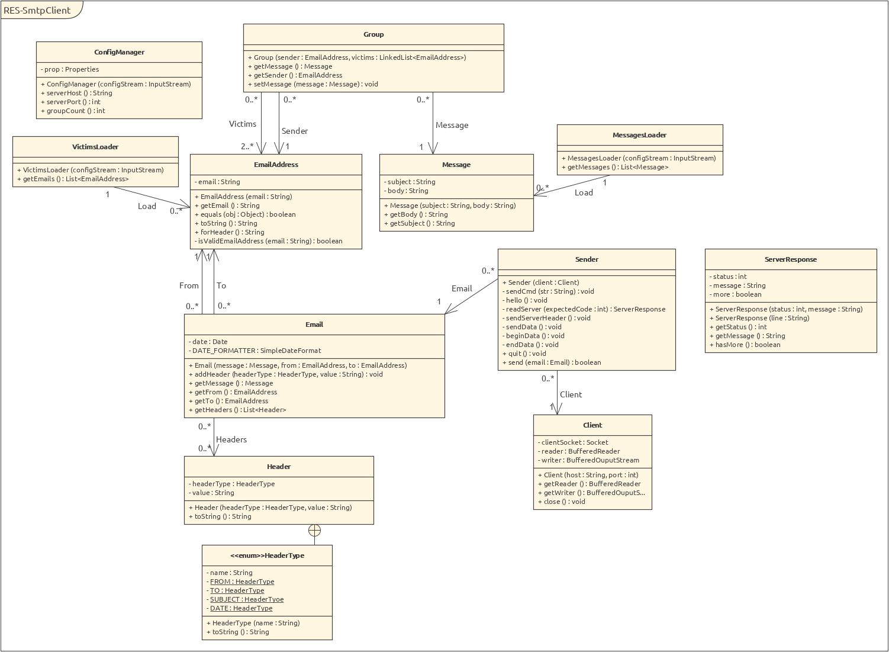

Julien Quartier & Nathan Séville

# Teaching-HEIGVD-RES-2019-Labo-SMTP

## Description

## Setup instructions

### Mockmock on Docker

> MockMock is a cross-platform SMTP server built on Java.
>
> MockMock GitHub: <https://github.com/tweakers/MockMock>

> If you don't have docker installed, install it before following following instructions.

In project's root directory build docker image with:

- `docker build -t mockmock .`

Create docker mockmock container:

- `docker run -d -p 2525:2525 -p 8282:8282 --name mockmock mockmock`

You can now access mockmock web interface at docker's container ip address on port `8282`.

You can stop container at any time with:

- `docker stop mockmock`

Start it again with:

- `docker start mockmock`

Delete container with:

- `docker rm mockmock`

### Prank campaign configuration

## Implementation description

Your report MUST include the following sections:

* **A brief description of your project**: if people exploring GitHub find your repo, without a prior knowledge of the RES course, they should be able to understand what your repo is all about and whether they should look at it more closely.

* **Instructions for setting up a mock SMTP server (with Docker)**. The user who wants to experiment with your tool but does not really want to send pranks immediately should be able to use a mock SMTP server. For people who are not familiar with this concept, explain it to them in simple terms. Explain which mock server you have used and how you have set it up.

* **Clear and simple instructions for configuring your tool and running a prank campaign**. If you do a good job, an external user should be able to clone your repo, edit a couple of files and send a batch of e-mails in less than 10 minutes.

* **A description of your implementation**: document the key aspects of your code. It is probably a good idea to start with a class diagram. Decide which classes you want to show (focus on the important ones) and describe their responsibilities in text. It is also certainly a good idea to include examples of dialogues between your client and an SMTP server (maybe you also want to include some screenshots here).

